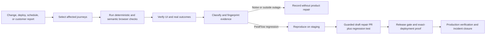

# Product Requirements Document: PestFlow Reliability Command Center

**Status:** Foundation implemented; full product phased

**Primary surface:** PestFlow desktop web application

**Execution platform:** Browserbase, Stagehand, Playwright, and GitHub Actions
**Last updated:** 2026-07-12

This PRD is deliberately twofold. Part I explains the problem and testing system
for someone who does not know PestFlow or software QA. Part II defines the actual
product, its requirements, architecture, safeguards, rollout, and current scope.

---

# Part I — Plain-language product summary

## What PestFlow is

PestFlow is operating software for pest-control companies. Owners and office
staff use the desktop application to manage customers, jobs, routes, technicians,
invoices, payments, reports, messages, inventory, and integrations. Technicians
also use field workflows, while customers interact with invoices, signatures,
portals, forms, and messages.

A small defect can therefore interrupt a real business outcome. A button may
look successful while an invoice was never stored, an email went to the wrong
person, a technician cannot open a job, or a payment integration did not save.
Customers normally describe this simply as “PestFlow is broken.”

## What browser testing means

A browser test opens PestFlow like a person would, visits screens, clicks or
inspects controls, and checks the result. A strong browser test does more than
check that a page loaded. It proves that:

- the correct person can reach the correct screen;
- the screen is usable at the required device size;
- the expected controls and data are present;
- no fatal browser or network error occurred;
- unsafe actions are not performed against production;
- the API, database, email provider, payment provider, or other system of record
  confirms the customer goal when the journey is allowed to write data.

Playwright is the deterministic test driver: it is precise and repeatable.
Stagehand adds semantic understanding: if a safe control moves or its markup
changes, it can locate the same approved action by meaning. Browserbase supplies
managed remote browsers, recordings, logs, and replay links. GitHub Actions starts
the right checks when code changes, on a schedule, or after deployment.

## The customer problem

PestFlow already has many useful tests and scheduled checks. The problem is that
they are separate, unevenly connected to releases, and sometimes noisy. A recent
example was a GitHub artifact-storage problem that marked otherwise passing test
runs as failed and unnecessarily triggered the repair system. At the same time,
a page-load test can still miss a real business failure behind a success message.

The product must solve both sides:

1. Detect real customer-facing regressions quickly and with strong evidence.
2. Refuse to treat test infrastructure, stale selectors, expired test sessions,
   third-party outages, or evidence-upload problems as PestFlow product bugs.

## Product vision

The Reliability Command Center is one closed loop from code change or customer
complaint to verified resolution:

## Why this is more demanding than ordinary QA

Ordinary test suites often stop after one layer says “success.” The Command
Center treats every release as untrusted until independent evidence agrees:

1. code-level tests prove calculations, contracts, and defensive behavior;
2. deterministic browser tests prove known controls and routes;
3. semantic browser checks behave like a person when safe UI structure moves;
4. deployment identity proves the tested build is the requested commit;
5. outcome oracles prove the API, database, or provider reached the intended
   business state; and
6. recordings, screenshots, network evidence, and timings make failures
   reproducible.

This cannot mathematically promise that production will never contain a bug.
Its practical goal is harsher and measurable: make critical escaped defects
rare, make repeated defects unacceptable, and make every ambiguous release fail
closed until there is enough proof.

The goal is not a mathematically impossible promise of no bugs. The practical
goal is to make critical regressions difficult to ship, detect escaped defects in
minutes, prevent repeat defects, and reduce customer-discovered production bugs
as close to zero as the product and operating environment allow.

## Who benefits

- PestFlow customers get fewer interruptions and faster verified fixes.
- The founder gets one truthful release-readiness view instead of interpreting
  many unrelated workflow emails.
- Engineers get reproducible evidence, exact routes and commits, and fewer flaky
  alerts.
- Support can turn a vague complaint into a structured incident and regression.
- Release operators can prove that they tested the commit that was actually
  deployed, not the previous healthy build.

---

# Part II — Product and implementation requirements

## 1. Product goals

The Command Center must:

- maintain a canonical registry of critical PestFlow journeys;
- map changed code to the journeys and device sizes that can be affected;
- combine deterministic Playwright checks with policy-controlled Stagehand help;
- collect replayable evidence from Browserbase;
- verify system-of-record outcomes for state-changing journeys;
- classify failures before opening a repair branch;
- deduplicate repeat occurrences under one incident fingerprint;
- reproduce real failures on staging before proposing product repairs;
- require regression coverage for every escaped production bug;
- gate promotion on evidence from the exact deployed commit;
- expose a durable Activity Log and coverage gaps;
- preserve human approval for risky code, data, payment, permission, and messaging
  changes.

## 2. Non-goals and safety boundaries

The system is not allowed to:

- let an autonomous browser agent choose unrestricted production actions;
- delete records, charge cards, send uncontrolled email/SMS, invite real users,
  change credentials, or disconnect integrations in production;
- merge product-code repairs automatically during the foundation phase;
- call an artifact-upload error or Browserbase outage a PestFlow regression;
- call a release green when required evidence is missing or skipped;
- certify a candidate URL without proving which commit that URL serves;
- treat a visible “Success” toast as the only proof of a business outcome.

## 3. Primary users and personas

### Command Center users

- PestFlow founder/admin: release readiness, incident ownership, approval.
- Engineer: evidence, reproduction, fix, regression, and PR review.
- Support/operator: customer report intake and incident correlation.
- QA maintainer: journey registry, device coverage, flake and healing review.

### PestFlow test personas

- Business owner
- Office administrator
- Technician
- Invited teammate
- Customer
- Commercial customer
- Unauthenticated prospect
- PestFlow founder/admin

Each authenticated persona needs its own isolated Browserbase context and safe QA
tenant. A context may preserve login state, but it must not share customer data or
permissions with another persona.

## 4. Command Center information architecture

The future owner-only dashboard should provide:

- **Release Readiness:** exact commit, required checks, passes, blocks, and gaps.
- **Test Registry:** every journey, owner, risk, schedule, devices, and oracles.
- **Live Runs:** current queue, Browserbase sessions, costs, and timeouts.
- **Critical Journeys:** business-goal coverage and recent reliability.
- **Incident Queue:** classification, fingerprint, occurrences, owner, and state.
- **Browserbase Replays:** recordings, screenshots, console, network, and actions.
- **Device Matrix:** required versus recently verified viewports.
- **Coverage Gaps:** unmapped routes, code areas, personas, and outcome oracles.
- **Flakes and False Alarms:** infrastructure and test-health trends.
- **Customer-Reported Bugs:** report-to-reproduction-to-regression lifecycle.
- **Activity Log:** every meaningful test, diagnosis, code, release, and closure step.
- **Self-Healing Decisions:** proposed/used selector recovery and human decisions.

GitHub Actions remains an orchestrator and release signal. It must not become the
long-term incident database.

## 5. Durable data model

The full product should persist:

- `qa_journeys`: canonical business journeys and policy.
- `qa_runs`: one execution, source trigger, commit, deploy, and result.
- `qa_steps`: ordered journey steps and timings.
- `qa_assertions`: expected/actual UI, API, DB, or delivery proof.
- `qa_artifacts`: replay URLs, screenshots, logs, and retention metadata.
- `qa_incidents`: deduplicated product or test incidents.
- `qa_incident_occurrences`: each repeat observation of an incident.
- `qa_coverage_gaps`: missing route, persona, oracle, device, or test.
- `qa_activity_log`: human-readable audit stream of meaningful work.

Required audit fields include actor, timestamp, environment, commit, deployment,
journey, step, action type, result, evidence links, incident, and PR when present.

## 6. Canonical journey registry

Every journey must declare:

- stable ID, title, persona, business goal, risk tier, and owner;
- routes and associated code areas;
- setup/fixture contract and safe tenant;
- allowed and forbidden actions;
- required viewports;
- deterministic, semantic, visual, console, and network assertions;
- API/database/delivery oracles;
- schedule and release triggers;
- last pass, known incidents, and coverage status.

The current foundation stores desktop journeys, devices, personas, policies, and
code associations in versioned JSON. One shared owner-route catalog defines all
27 static owner surfaces. The deterministic production suite applies it at three
widths for 81 complete route contracts, and the cloud fallback consumes the same
catalog so the layers cannot silently drift apart. A second registry defines 32
authenticated, read-only API contracts behind those surfaces and requires status,
JSON shape, and declared array types without preserving response bodies. The
future dashboard imports and enriches those registries without making code review
optional.

## 7. Execution modes

### Deterministic mode

Playwright owns stable critical mechanics: routes, redirects, cookies, forms,
network status, console failures, exact values, and outcome assertions. These
checks are the first choice when a precise assertion is possible.

### Stagehand-assisted mode

Stagehand may `observe()` or `extract()` structured state. Before any `act()`, the
runner validates the proposed method, target, destination, arguments, journey
allowlist, environment, and write policy. A semantic recovery is logged; it does
not silently rewrite the canonical test.

### Exploratory mode

Nightly read-only exploration inventories visible actions, dead routes, blank
screens, stale buttons, errors, and unexpected UI. Findings create coverage-gap
proposals. They do not mutate production or automatically change product code.

## 8. Evidence and outcome oracles

Every browser run should record environment, source commit, deployed commit,
journey, persona, device, Browserbase session/replay, screenshots, console errors,
failed network calls, semantic expected-versus-actual state, Stagehand history,
timings, and GitHub run.

The current foundation also runs four public GET-only oracles before selected
candidate and scheduled browser checks: frontend service health, API service
health, database reachability/current time, and critical desktop schema. During a
candidate release, both service health responses must expose the expected commit
SHA. Oracle artifacts retain status and assertion evidence but no response bodies.

Until the managed Browserbase owner context is activated, the current branch also
expands the existing Checkly canary login into a read-only authenticated owner
smoke across all 27 static owner paths in the Guardian registry. The policy suite
requires fallback/registry parity, so a newly added desktop owner route cannot be
silently omitted. The branch version has earlier live cloud proof for the core
route set; the expanded exact-head sweep still requires a deliberate post-review
Checkly deploy and a new cloud run after GitHub runner availability returns. This
is a useful interim production layer, not a substitute for the multi-viewport
semantic Guardian and its persistent replay.

The same 27-route contract now drives the deterministic production audit at
1440×900, 1280×800, and 1024×768. It attempts all 81 combinations and preserves
the complete matrix even after a route fails, allowing the remaining tenant,
role, invoice, scheduling, and cleanup evidence to finish.

The authenticated owner API sweep independently attempts all 32 registered GET
contracts and records only status, content type, timing, observed key names, and
array counts. Its first production run on 2026-07-12 passed 31/32 and reproduced
the company-branches HTTP 500. The same branch includes the server repair plus a
state-changing synthetic-tenant regression for creation, single-primary
enforcement, cross-tenant denial, primary transfer, and safe deactivation.
The next write-path layer covers equipment, preset notes, and chemical products:
each resource is created, found in its list, blocked from cross-tenant mutation,
updated, explicitly deleted, and proved absent. A focused production run passed
all three lifecycles and completed 5/5 account/session/login-rejection cleanup.
Provider-safe communication coverage now proves an unsigned recipient-free
service document, response-template archive, disabled auto-response rule,
same-company team-message read state, cross-company isolation, and notification
preference restore. It cannot sign, email, text, enable the rule, charge, or call
an external provider. The focused live run passed and again removed all five
accounts.

Operational inventory testing then exposed a critical tenant-integrity defect in
the currently deployed API: a second disposable owner could associate the first
owner's job/equipment and job/customer UUIDs, and both POST requests returned
200. The branch repair validates UUIDs and requires every referenced job,
customer, technician, and equipment row to belong to the caller company before
insert. Six route tests pass. The production regression deliberately remains red
until the reviewed repair is deployed and returns 404 for both attempts.

The fix is defense-in-depth, not route-only. Migration
`a24_operational_tenant_integrity.sql` adds six composite company/reference
foreign keys for chemical logs and job-equipment usage. They are installed as
`NOT VALID`: PostgreSQL rejects every new mismatched relationship immediately,
while the system preserves pre-existing rows for separately reviewed repair.
The public schema oracle requires all six constraint names, so a migration that
is logged but skipped cannot produce a green release verdict.

An explicit aggregate-only production audit runs inside a database-enforced
read-only transaction. It returns counts and timestamps, never row IDs, names,
emails, addresses, chemical names, or notes. The first audit found zero
job-equipment mismatches and three historical chemical-log/product mismatches
among 94 logs. Those three non-QA records share one company pair and one creation
timestamp, involve different owners and company names, and have no same-name
replacement product in the log-owning company. No historical data was changed;
review and repair require a separate authorized workflow.

A state-changing journey is green only when all required layers agree. For an
invoice send, that can include UI completion, API response, invoice row, correct
customer and billing type, delivery audit, provider acceptance, correct PDF, and
duplicate prevention. Equivalent outcome contracts apply to SMS, signatures,
GPS, inventory, invitations, payments, AI bookings, and Website Chat.

### Deterministic QA fixture lifecycle

The current desktop critical suite is allowed to write only because its identity
and teardown contract is narrower than ordinary production activity. It creates
five short-lived accounts on a reserved non-customer domain: two isolated owners
and three invited roles. Each signup is registered for cleanup before onboarding
or invite redemption continues. Customer email delivery is suppressed for the
reserved domain, invoice notification delivery is disabled, and real payment
provider sends remain off by default.

Teardown runs invitees before owners, restores a logged-out test session when
necessary, deletes the exact QA account, verifies no session remains, waits out
bounded authentication rate limits, and proves the credentials cannot sign in.
It emits a password-free cleanup artifact and fails the entire run when any proof
is missing. Owned-company deletion is a strict privacy boundary: the auth user
cannot be removed if its company-scoped business data fails to cascade.

## 9. Failure taxonomy and incident policy

Supported categories are:

- `product_regression`
- `visual_regression`
- `test_selector_drift`
- `test_data_failure`
- `authentication_context_expired`
- `third_party_outage`
- `deployment_not_ready`
- `browserbase_infrastructure`
- `github_infrastructure`
- `artifact_storage_failure`
- `non_reproducible_flake`

Before a product repair PR, the system must confirm a customer-facing assertion,
retry in a fresh session, reproduce twice or obtain strong backend proof,
fingerprint the incident, deduplicate it, and reproduce on staging. The
fingerprint uses journey, step, route, error class, HTTP status, semantic
difference, and subsystem. Repeat occurrences update one incident instead of
creating duplicate branches, PRs, or emails.

## 10. Gated healing

- **Level 0:** approved semantic selector recovery; continue and log.
- **Level 1:** test-only repair proposal when product behavior is proven correct.
- **Level 2:** staging-reproduced product repair proposal with a permanent test,
  affected suite, critical gate, preview proof, and draft PR.
- **Level 3:** possible future auto-merge only for proven low-risk test/config
  changes with every gate green.

Payments, permissions, migrations, messages, customer data, and product behavior
always require human approval unless a later policy is explicitly approved.

## 11. Critical suites and device matrix

Required product suites include authentication/onboarding, owner business day,
technician field day, invoice/payment/contract, messaging, GPS/routes, inventory,
public/customer journeys, Website Chat, AI receptionist/calendar, admin and
permissions, and whole-app exploration.

The complete viewport catalog is 1920×1080, 1440×900, 1280×800, 1024×768,
768×1024, 390×844, and 360×800. Each journey selects only relevant viewports on a
pull request; nightly rotation covers the broader matrix. The current Guardian
foundation is desktop-first and actively covers the first four sizes.

## 12. Trigger and release policy

- Pull request: unit/contracts, change-map validation, build, and risk selection.
- Candidate deployment: public outcome oracles plus selected deterministic and
  Browserbase journeys.
- Production deployment: immediate critical canary and deployed-SHA proof.
- Every 10 minutes: future lightweight auth/app/API/asset health.
- Hourly: highest-risk safe journeys.
- Nightly: full registry and read-only exploration.
- Weekly: controlled real delivery/integration proof.
- Customer report: immediate reproduction and required regression creation.

A release blocks when a selected product check fails, required evidence is
missing, an authenticated persona is skipped, Browserbase is required but not
configured, or the candidate URL does not report the expected commit. Evidence
upload/storage failures are recorded but do not masquerade as product failures.

## 13. Customer bug lifecycle

Capture customer/role, route, timestamp, device/browser, expected and actual
behavior. Correlate with Sentry, PostHog, Railway, API, database, and provider
evidence. Reproduce in Browserbase, attach the replay, fix on a guarded branch,
add a permanent regression, verify staging and production, and close only after
consecutive production passes.

**Policy:** no production bug closes without a regression test or a written,
reviewed reason that automation is not possible.

## 14. Success measures

Within 60–90 days:

- 100% of critical journeys assigned to automated coverage;
- critical production detection under 10 minutes;
- post-deploy critical verification under 15 minutes;
- false-red rate below 2% and flake rate below 1%;
- every browser failure carries replay and network evidence;
- every production regression receives a permanent test;
- zero duplicate repair branches for the same incident;
- near-zero repeated customer-reported bugs;
- material reduction in newly customer-discovered regressions.

Supporting measures include journey/device/oracle coverage, median detection and
repair time, healing acceptance rate, stale-context rate, infrastructure failure
rate, and Browserbase sessions/cost per release.

## 15. Rollout and current phase

1. **Truth and metrics:** inventory current workflows and critical paths.
2. **Signal quality:** classify failures, ignore artifact false-reds, deduplicate.
3. **Browser foundation:** guarded Stagehand runner, contexts, evidence, budgets.
4. **Essential journeys:** auth, owner operations, technician, invoice/delivery,
   and mobile safety with real outcome oracles.
5. **Complete coverage:** inventory, GPS, messaging, portals, chat, AI, admin.
6. **Release shield/dashboard:** deploy gates, exact-SHA proof, Activity Log.
7. **Guarded healing:** staging reproduction, regression enforcement, trust levels.

The current branch substantially implements phases 1–3, the desktop release
shield foundation, public frontend/API/database/schema outcome oracles, and a
self-cleaning deterministic production fixture lifecycle. It
does not claim the durable dashboard, every persona, authenticated write/delivery
oracles, or full autonomous repair lifecycle is complete.

The reusable outside-in portion is published in the separate public
`gicheru214/Browser-Base-QA` repository with `yawbtng` as a write collaborator
and code owner. That repository owns Browserbase/Stagehand orchestration and the
cross-repository release gate. PestFlow retains product-side health/deployment
identity, isolated fixture lifecycle, deterministic regressions, and fixes.

## 16. Foundation acceptance criteria

The current foundation is acceptable when:

- the registry and every static desktop route are policy-validated;
- the shared 27-route catalog is consumed by both cloud fallback and the 81-check
  deterministic route/viewport matrix;
- the 32-endpoint owner API catalog is policy-validated and completely attempted
  without retaining response bodies;
- all non-mobile feature source files map to a release-risk rule;
- production runs reject unsafe semantic actions;
- authenticated journey skips block a release;
- missing Browserbase activation blocks selected deployed-candidate evidence;
- deterministic desktop and delegated feature suites pass;
- artifact quota failures cannot create false product regressions;
- GitHub billing/spending refusals are captured and classified as infrastructure;
- local browser suites cannot silently reuse a server from another worktree;
- repeated incident fingerprints reuse a repair branch/PR;
- the exact deployed SHA can be verified before a browser session;
- GET-only frontend/API/database/schema oracles are required release evidence;
- deterministic production fixtures are narrowly identified, communication-safe,
  self-deleting, and backed by deletion/session/login-rejection evidence;
- CI, TypeScript, focused lint, build, and workflow parsing are green;
- the Excel Activity Log and documentation reflect actual evidence and gaps.

## 17. Dependencies and open activation work

Live managed-browser execution requires GitHub secrets
`BROWSERBASE_API_KEY`, `BROWSERBASE_PROJECT_ID`, and
`PESTFLOW_QA_OWNER_CONTEXT_ID`. The context must be logged into an isolated,
read-only-safe PestFlow QA owner account. A deployment workflow must call the
reusable release gate with candidate URLs and `expected_sha`, and its result must
be required before promotion. Those account and deployment-policy actions are
intentional activation steps, not hidden green checks.

Earlier deterministic runs predate the verified cleanup lifecycle. A one-time,
DB-authorized inventory and deletion of historical `pestflow-e2e.test` fixtures
remains an explicit data-hygiene task; it must preview exact counts and receive
deletion authority rather than introducing a broad production cleanup endpoint.
The read-only production inventory on 2026-07-12 found 55 QA users, 22 owned
companies, 66 sessions, and 22 each of customers, jobs, and invoices, plus their
company-scoped and email-audit dependencies. No record content or identifier was
returned and no data was changed.

GitHub Actions runner availability is also a release dependency. On 2026-07-12,
isolated Checkly rerun `29205363968` for commit `4f6df89` was refused before any
step started because the GitHub account reported a payment/spending-limit issue.
That event is classified as `github_infrastructure`; it provides no product
verdict and must be rerun at the exact commit after runner access is restored.

The exhaustive production owner audit on 2026-07-12 passed 69/78 route/viewport
contracts and found Services readiness drift, SMS Contacts and Common Replies
crashes, and a Settings branch API 500. Branch fixes passed focused 12/12 rendered
checks plus the full 194-test desktop feature suite. Acceptance still requires
deployment of the reviewed commit and a new live 81/81 certification. The
historical 69/78 evidence predates the Move-In Assistant route added on `main`;
the current dynamic catalog includes that twenty-seventh route automatically.
The subsequent authenticated API contract audit passed 31/32 and reproduced only
the already-known production branch endpoint failure; 5/5 disposable accounts
were deleted with session clearing and credential rejection proved.
The focused owner-resource lifecycle then passed equipment, preset notes, and
chemical products against production in 2.4 minutes, with all five disposable
accounts again fully removed and rejected at sign-in.
The subsequent provider-safe document/internal-communications lifecycle also
passed in 2.4 minutes, with response records cleaned, preferences restored, and
5/5 account/session/login-rejection teardown proved.
The operational-inventory production test then confirmed both cross-company
write attempts return 200 on the current deployment. Two controlled discovery
runs removed the temporary equipment association where possible and each proved
5/5 account deletion, session clearing, and sign-in rejection. Branch unit,
TypeScript, and lint proof is green; production certification is red pending
deployment and a 404/404 rerun.
The follow-up read-only database inventory confirmed that job-equipment history
currently has zero cross-company relationships, but three non-QA chemical logs
reference a product owned by a different company. Because all three share one
pair and the exact same May 27 timestamp, the evidence is consistent with a
single historical batch/import event, but that is an inference rather than a
proven cause. The branch prevents recurrence at both API and database layers and
keeps cleanup outside this PR until the affected business records are reviewed.
